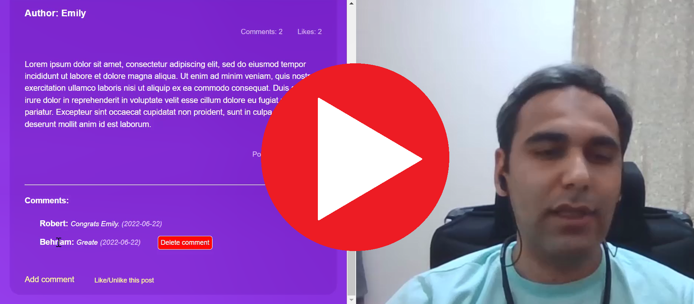

 

# Blog App

A blogging platform created using Ruby on Rails. 

# How it looks like

# Live demo 

Please check out the [live demo deployed on heroku](http://rails-blog1000.herokuapp.com/users/sign_in). 

# Presentational Video 

# Requirements for this project

[1- Setup and controllers](https://github.com/microverseinc/curriculum-rails/blob/main/blog-app/projects/Setup_Controllers_project.md)

[2- Controllers specs](https://github.com/microverseinc/curriculum-rails/blob/main/blog-app/projects/controller_specs_project.md)

[3- Creating data model](https://github.com/microverseinc/curriculum-rails/blob/main/blog-app/projects/creating_data_model_project.md)

[4- Processing data in models](https://github.com/microverseinc/curriculum-rails/blob/main/blog-app/projects/Processing_data_model_project.md)

[5- Views](https://github.com/microverseinc/curriculum-rails/blob/main/blog-app/projects/Views_project.md)

[6- Add forms](https://github.com/microverseinc/curriculum-rails/blob/main/blog-app/projects/forms_project.md)

[7- Validations, model specs, and n+1 problems](https://github.com/microverseinc/curriculum-rails/blob/main/blog-app/blog_app_validations_model_spec_n+1.md)

[8- Add devise](https://github.com/microverseinc/curriculum-rails/blob/main/blog-app/blog_app_devise.md)

[9- Add authorization rules](https://github.com/microverseinc/curriculum-rails/blob/main/blog-app/projects/Integration_specs_project.md)

[10- Integration specs for views](https://github.com/microverseinc/curriculum-rails/blob/main/blog-app/projects/Integration_specs_project.md)

[11- Add API endpoints](https://github.com/microverseinc/curriculum-rails/blob/main/blog-app/blog_app_api_endpoints.md)

# Demo of the app

Will be added

# Project screenshots

Will be added

## Installation & Usage

To get a local copy follow these simple example steps. 
- Make sure you have `Postgres` and `Ruby` installed. 
- Open the terminal window and clone the repository using this command: `git@github.com:Behnam1369/rails-blog.git` 
- Open the repo by typing : `cd rails-blog`
- Install the project's dependencies by running this command: `bundle install` 
- Make sure you have database user called `blog_user`.
- Make sure you have a `db.rb` file under the `config` folder and it should be containing `ENV['BLOG_DATABASE_PASSWORD'] = 'your_password'`.
- run `rails db:create` to create the database.
- run `rails db:migrate` to create the the dchema. 
- run `rails s` to start the application on local server. 
- To test the project, run `rspec` in your terminal 

## Technologies

- Ruby
- Rails 
- Postgres 

## Authors

👤 **Behnam Aghaali**

- GitHub: [https://github.com/Behnam1369](https://github.com/Behnam1369)
- LinkedIn: [https://www.linkedin.com/in/behnam-aghaali](https://www.linkedin.com/in/behnam-aghaali)
- Twitter: [https://twitter.com/behnamagh1369](https://twitter.com/behnamagh1369)

👤 **Victor Peralta**

- GitHub: [https://github.com/VicPeralta](https://github.com/VicPeralta)
- LinkedIn: [https://www.linkedin.com/in/vicperalta/](https://www.linkedin.com/in/vicperalta/)
- Twitter: [https://twitter.com/VicPeralta](https://twitter.com/VicPeralta)

## 🤝 Contributing

Contributions, issues, and feature requests are welcome!

Feel free to check the [issues page](https://github.com/Behnam1369/Catalog_of_my_things/issues).

## Show your support

Give a ⭐️ if you like this project!

## Acknowledgments

- Hat tip to anyone whose code was used
- Inspiration
- etc

## 📝 License

This project is [MIT](./LICENSE) licensed.